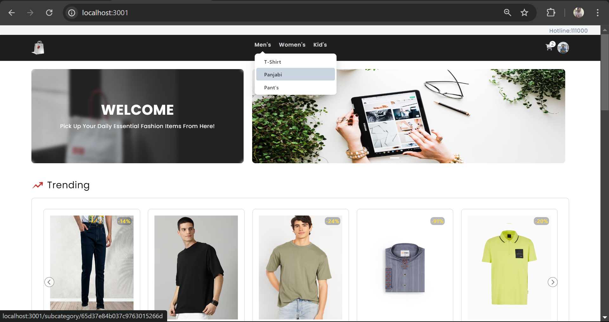
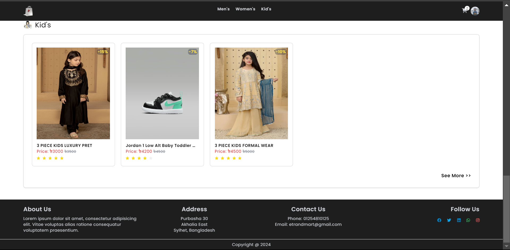
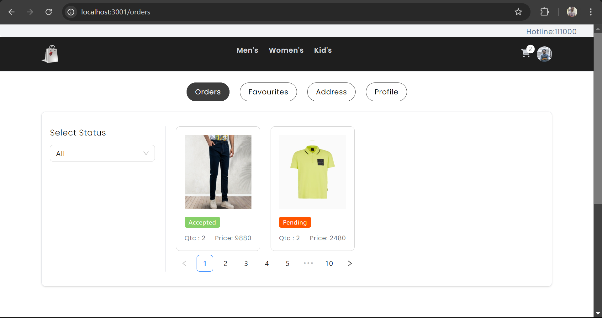
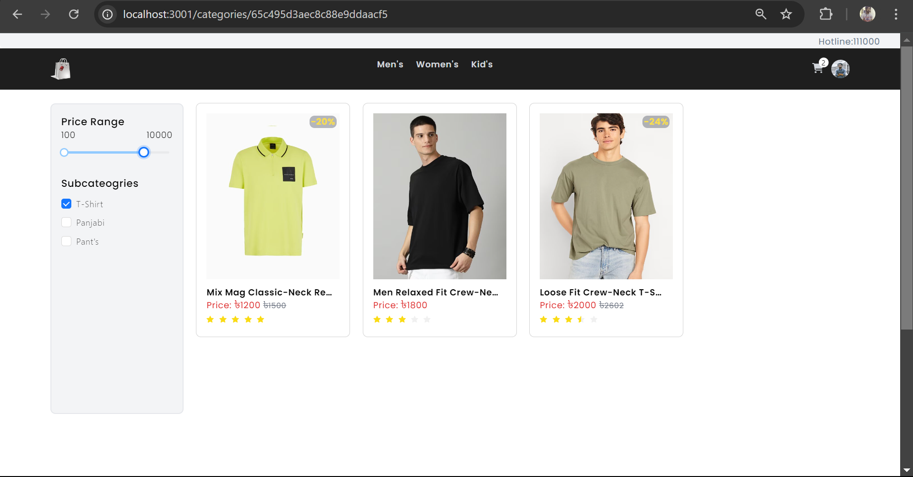
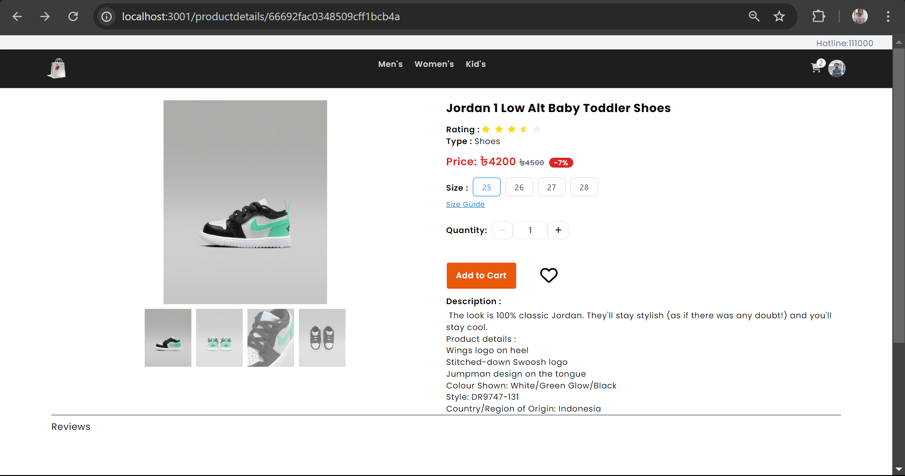
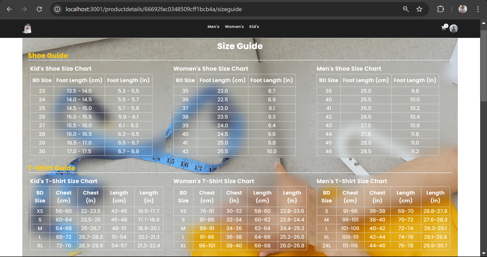
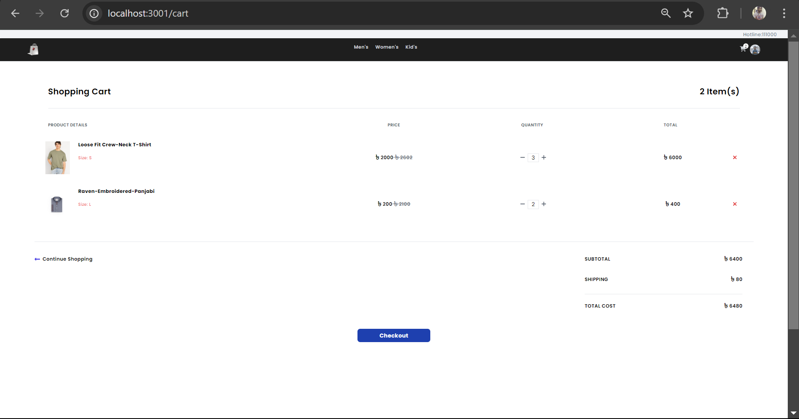
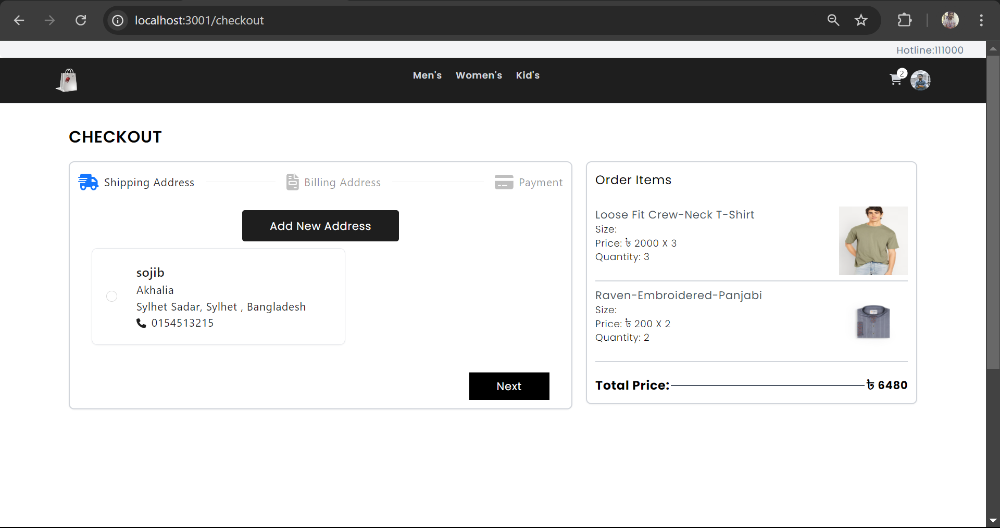

# TrendMart

## Description
TrendMart is a fully responsive, web-based e-commerce application designed for selling fashion-related items across categories including men, women, and kids. The platform features a dynamic and intuitive user interface for customers, as well as a robust admin dashboard that allows seamless management of products, users, orders, and inventory. The application ensures an efficient and engaging shopping experience, while the admin section provides advanced controls for overseeing the business operations.

## Table of Contents
- [Installation](#installation)
- [Usage](#usage)
- [Features](#features)
- [Technologies Used](#technologies-used)
- [Screenshots](#screenshots)


## Installation
1. Clone the repository:
   ```bash
   git clone https://github.com/hridoy00005/TrendMart-app.git
2. Navigate to the project directory:
   cd TrendMart-app
3. Install dependencies:
   npm install or yarn install

## Usage
To start the development server, run:
npm run dev or yarn dev

## Features
1. User authentication (Login/Signup/Reset Password)
2. Product catalog management
3. Shopping cart and checkout
4. Admin dashboard with product and order management

## Technologies Used
1. ReactJs
2. Redux Toolkit
3. Tailwind CSS
4. AntD
5. Axios
6. MongoDB(database)
7. Node.js (Backend)


## Screenshots 

Home page with Navbar, Hero section and Trending Items.


Footer section with Displayed Some Kid's Items.


Account page with Order, Favourites, Address and Profile Categories.


Men Categories page with Filtered T-Shirt.


Product Details page.


Size Guide page.


Cart page.


Checkout page.



First, run the development server:

```bash
npm run dev
# or
yarn dev


Open [http://localhost:3000](http://localhost:3000) with your browser to see the result.

You can start editing the page by modifying `app/page.js`. The page auto-updates as you edit the file.

This project uses [`next/font`](https://nextjs.org/docs/basic-features/font-optimization) to automatically optimize and load Inter, a custom Google Font.

## Learn More

To learn more about Next.js, take a look at the following resources:

- [Next.js Documentation](https://nextjs.org/docs) - learn about Next.js features and API.
- [Learn Next.js](https://nextjs.org/learn) - an interactive Next.js tutorial.

You can check out [the Next.js GitHub repository](https://github.com/vercel/next.js/) - your feedback and contributions are welcome!

## Deploy on Vercel

The easiest way to deploy your Next.js app is to use the [Vercel Platform](https://vercel.com/new?utm_medium=default-template&filter=next.js&utm_source=create-next-app&utm_campaign=create-next-app-readme) from the creators of Next.js.

Check out our [Next.js deployment documentation](https://nextjs.org/docs/deployment) for more details.
